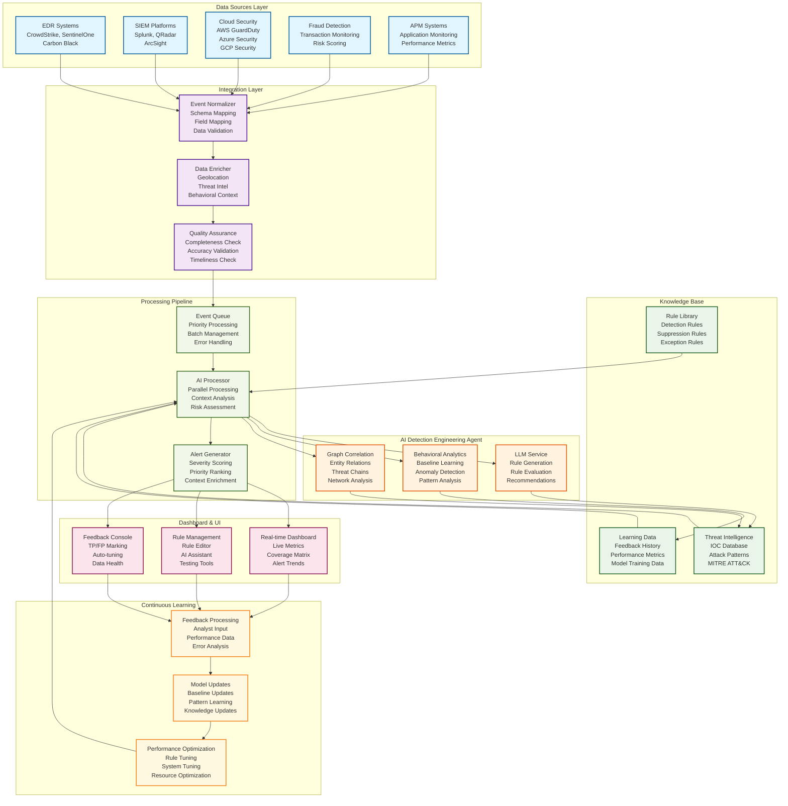
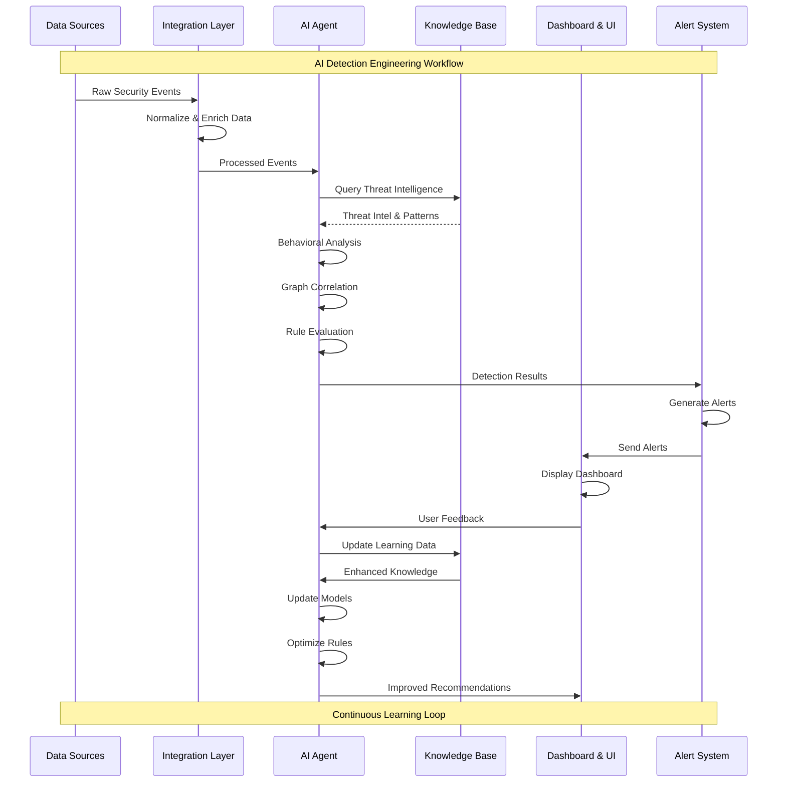
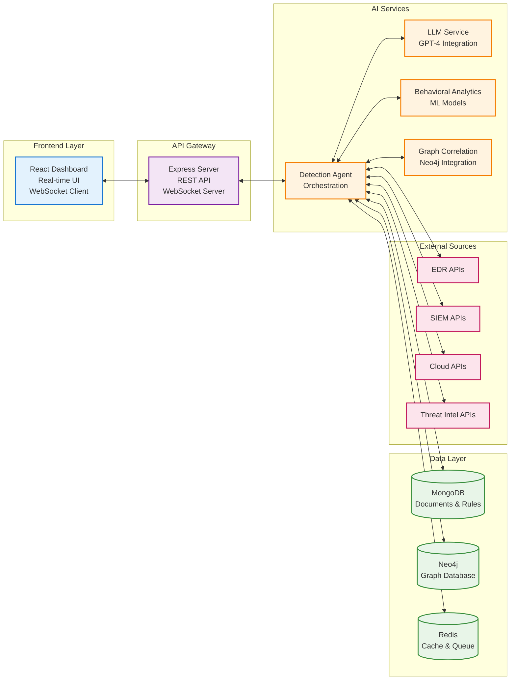
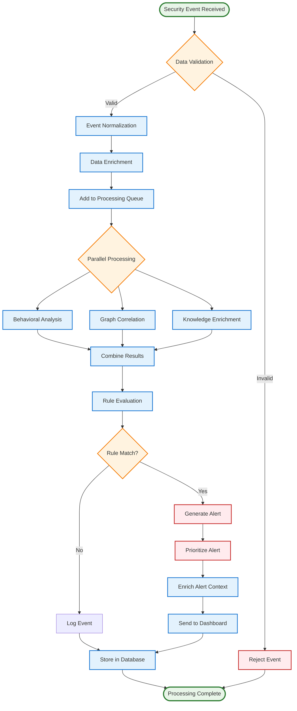
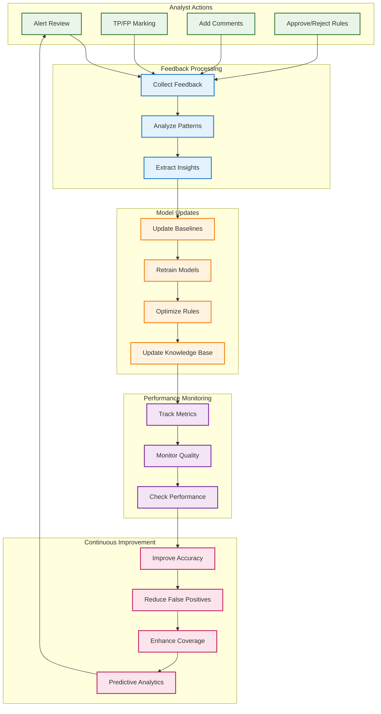

# AI Detection Engineering Agent - Mermaid Workflow Diagram

## Complete System Workflow (Mermaid)

## Detailed Processing Flow (Mermaid)

## System Architecture Overview (Mermaid)

## Event Processing Pipeline (Mermaid)

## Learning Loop Process (Mermaid)

These Mermaid diagrams provide a comprehensive visual representation of the AI Detection Engineering Agent workflow and can be rendered in GitHub, GitLab, and other platforms that support Mermaid syntax.
